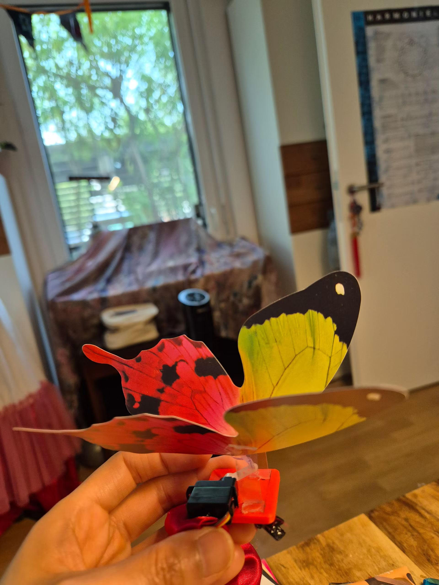
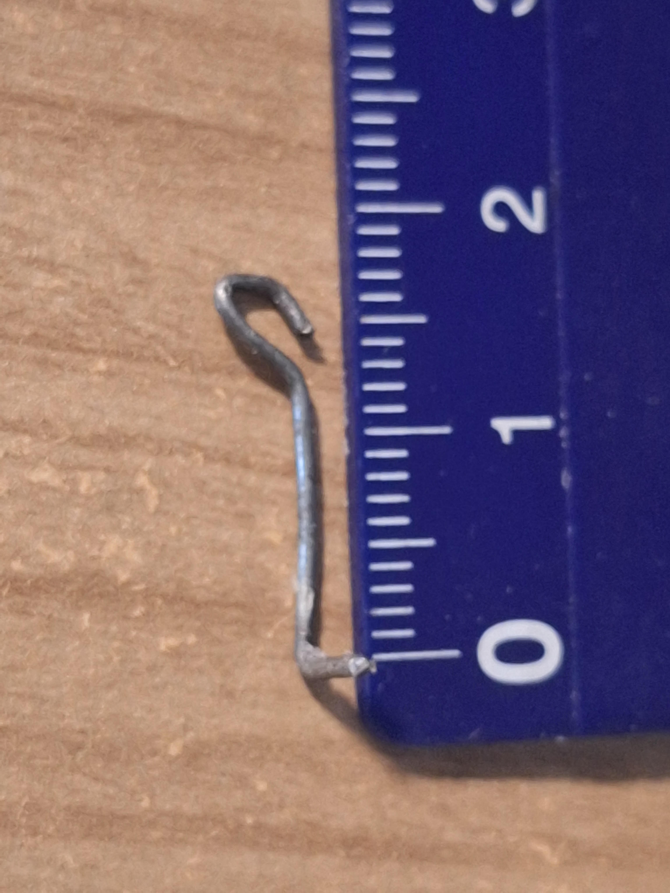
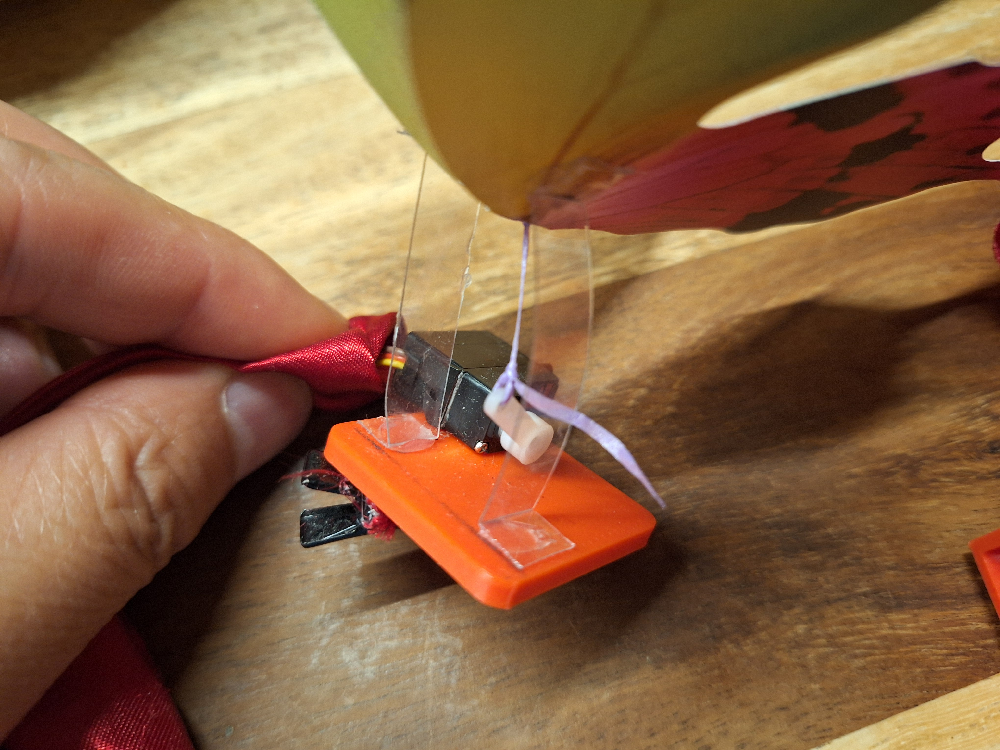
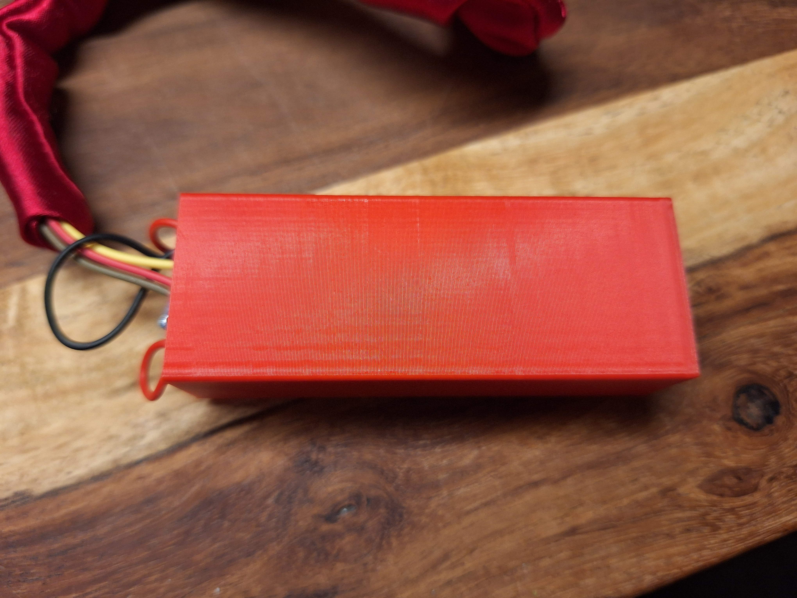
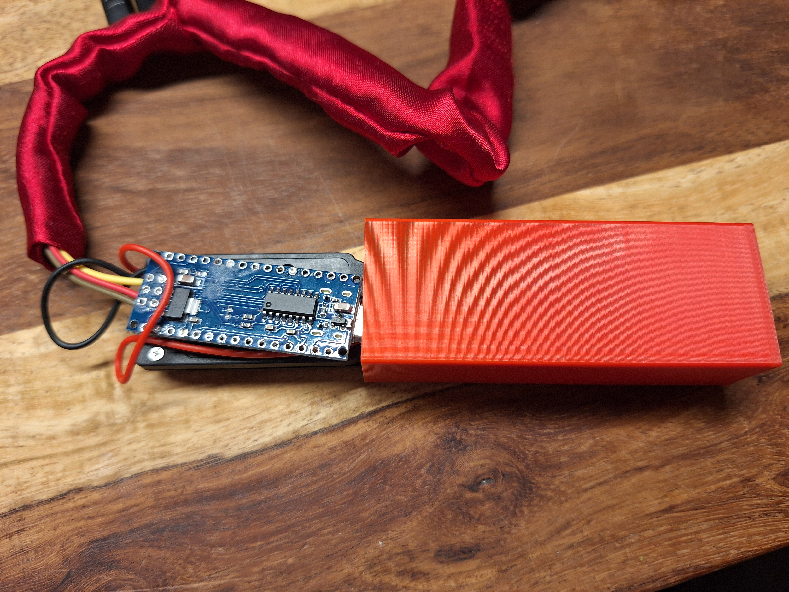
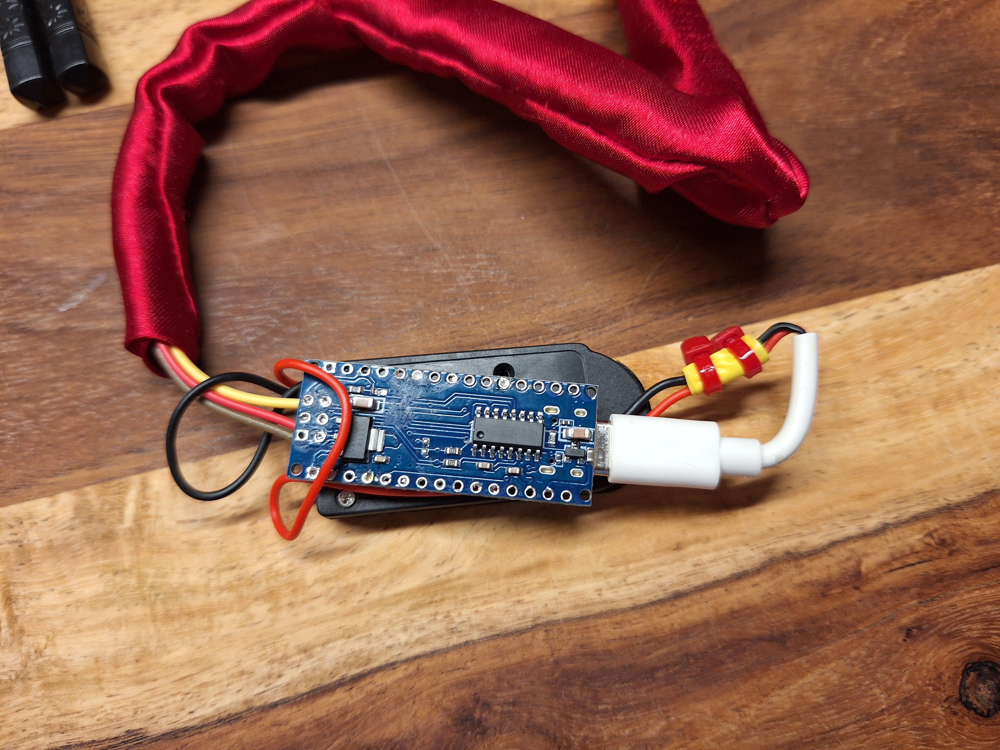

# SG90 扑翼蝴蝶 (SG90 Mechanical Butterfly)

本项目是一个基于 **Arduino Nano** 和 **SG90 微型舵机** 控制的机械扑翼蝴蝶装置。通过舵机的往复旋转驱动连杆或拉线机构，带动塑料悬挂片与蝴蝶翅膀，实现逼真的蝴蝶煽动翅膀效果。

---

## 📸 项目成品、实拍与演示视频

| 成品总体示意图 | 连杆制作尺寸参考 | 细节：细线传动替代方案 |
| :---: | :---: | :---: |
|  |  |  |

| 控制盒外观 (`box.stl`) | 内部 Arduino Nano 模块 | 板载接线特写 |
| :---: | :---: | :---: |
|  |  |  |

🎬 **动态效果视频**：可在 [Demo/20260920_181137.mp4](./Demo/20260920_181137.mp4) 查看蝴蝶实际扇动翅膀的总体验收效果。

---

## 🛠️ 材料与清单 (BOM)

| 类型 | 项目 | 规格 / 描述 | 数量 |
| :--- | :--- | :--- | :--- |
| **主控** | Arduino Nano 开发板 | ATmega328P | 1 板 |
| **执行器** | SG90 9g 微型舵机 | 4.8V-6V 驱动 | 1 个 |
| **电源** | 纽扣电池盒 / 电池 | 给 Arduino 及舵机供电 | 1 套 |
| **3D打印件** | [basement.stl](./3D_Druker/basement.stl) | 固定 SG90 电机与透明塑料片的安装底座 | 1 件 |
| **3D打印件** | [box.stl](./3D_Druker/box.stl) | 收纳 Arduino Nano 板子与纽扣电池盒的外壳 | 1 件 |
| **传动结构** | 塑料悬挂片 | 剪自透明塑料盒（水果盒硬度），宽 8mm，长 45mm | 2 片 |
| **传动结构** | 金属连杆 / 细拉线 | **方案A**：铁丝/钢丝弯制连杆 (直杆 13mm，总长 16mm)<br>**方案B**：一根细线/棉线 (替代连杆连接舵机摇臂) | 1-2 根 |
| **装饰部件** | 蝴蝶翅膀 | 纸质或轻质塑料制成的蝴蝶造型 | 1 双 |

---

## 📐 物理尺寸与加工参数

详细参数来源：[Data.txt](./Data.txt)

1. **透明塑料悬挂片制作**：
   - 材质要求：推荐使用水果盒上的透明塑料片（韧性适中，不硬不软）。
   - 尺寸规格：宽度 **8mm**，中间活动段长度 **35mm**，两头各保留 **5mm** 粘贴区（总长 **45mm**）。
   - 粘贴位置：在蝴蝶翅膀底部距离中央折痕 **5mm** 处粘贴透明塑料片。
   - 安装间距：在底座（`basement.stl`）上面，左右两片塑料片的安装间距为 **15mm**。

2. **传动机构（连杆 vs 细线）：**
   - **方案 A（金属连杆）**：直杆部分长 **13mm**，顶端折弯一个挂环/小钩，底端弯一个小直角折弯卡入舵机臂，总长为 **16mm**（参考照片 [Stab.jpg](./Demo/Stab.jpg)）。
   - **方案 B（细线替代方案）**：如果不想制作/使用金属连接杆，**也可以使用一根细线（如细棉线或尼龙线）把蝴蝶翅膀和舵机摇臂直接连接起来**。如视频 [20260920_181137.mp4](./Demo/20260920_181137.mp4) 以及细节图 [20260919_211957.jpg](./Demo/20260919_211957.jpg) 所示。

3. **3D 打印件说明**：
   - 文件路径：`3D_Druker/`
   - `basement.stl`：安装底座，放置 SG90 电机，固定塑料臂。
   - `box.stl`：电路收纳盒，可刚好容纳 Arduino Nano 及纽扣电池盒。

---

## 🔌 电路接线说明

| SG90 舵机引脚 | Arduino Nano 引脚 | 备注 |
| :--- | :--- | :--- |
| **信号线 (黄色/橙色)** | **D8 (Pin 8)** | PWM 控制信号输出线 |
| **正极 VCC (红色)** | **5V / 电池正极** | 电源供电 |
| **负极 GND (棕色/黑色)** | **GND / 电池负极** | 共地连接 |

> **注意**：纽扣电池盒的电源接线需同时为 Arduino Nano (如 VIN/5V 引脚) 和 SG90 舵机供电。参考硬件细节图 [20260919_211946.jpg](./Demo/20260919_211946.jpg)。

---

## 💻 软件与代码说明

代码存储在 [sg90.ino](./sg90/sg90.ino)。

```cpp
#include <Servo.h>

Servo servo;
int angle = 175;

void setup() {
  servo.attach(8);     // 舵机信号线连接到 Pin 8
  servo.write(angle);  // 初始角度设置为 175° (最高点/展平位置)
}

void loop() { 
  // 从 175° 平滑旋转到 120° (向下扑翅)
  for(angle = 175; angle > 120; angle--) {                                  
    servo.write(angle);               
    delay(15);                   
  } 
  // 从 120° 平滑返回到 175° (向上展开)
  for(angle = 120; angle < 175; angle++) {                                
    servo.write(angle);           
    delay(15);       
  } 
}
```

### 角度与动作逻辑：
- **175° (最高点)**：对应翅膀完全**展平**状态。
- **120° (最低点)**：对应翅膀**下扇/收拢**状态。
- **扇动范围**：120° ~ 175° (幅度约 55°)。
- **速度控制**：每个步距 1° 延迟 15ms，周期约 1.65 秒/次扑翼。

---

## 🔧 组装与调校步骤 (Step-by-Step)

### 第 1 步：打印 3D 外壳件
使用 3D 打印机打印 `3D_Druker/` 目录下的：
- [basement.stl](./3D_Druker/basement.stl)
- [box.stl](./3D_Druker/box.stl)

### 第 2 步：制作翅膀与塑料挂片
1. 准备一对剪裁好的蝴蝶翅膀（纸质或薄塑料片）。
2. 从塑料盒上剪出两片 8mm × 45mm 的透明塑料片。
3. 在塑料片两端各留 5mm 粘贴区，中间 35mm 为悬空摆动段。
4. 将塑料片一端粘在底座上（两片间距 15mm），另一端粘在蝴蝶翅膀上（距离翅膀中缝折痕 5mm 处）。

### 第 3 步：连接传动机构（连杆或细线）
- **方式一（金属连杆）**：截取适长金属铁丝/钢丝，弯成直杆 13mm、总长 16mm 的拉杆扣入舵机臂（参考 [Stab.jpg](./Demo/Stab.jpg)）。
- **方式二（细线连接）**：如果不想使用连杆，可以用一根细线穿过蝴蝶翅膀中央下方，直接结扣系在 SG90 舵机的白色摇臂上（参考 [20260919_211957.jpg](./Demo/20260919_211957.jpg)）。

### 第 4 步：电路组装与烧录
1. 将 [sg90.ino](./sg90/sg90.ino) 烧录至 Arduino Nano。
2. 按电路接线图将 SG90 舵机接至 Pin 8，电源连接纽扣电池盒。
3. 将 Arduino Nano 和电池盒放入 3D 打印的 [box.stl](./3D_Druker/box.stl) 内部（参考 [20260919_211933.jpg](./Demo/20260919_211933.jpg)）。

### 第 5 步：机械调校（最关键步骤）
1. 通电使舵机旋转至初始位置 **175°**（即程序中的最高点位置）。
2. 在该最高点位置固定舵机摇臂，安装金属连杆或系紧细线。
3. 调整连杆或细线拉力，确保**在舵机处于 175° 最高点时，蝴蝶翅膀恰好完全展平**。
4. 调试无误后固定舵机与底座。

---

## 💡 经验与注意事项

- **调试技巧**：安装连杆或系细线前一定要先运行程序让舵机回到 175° 初始位置，否则机械零点对不准会导致扑翅角度异常或拉卡卡死。
- **拉线替代说明**：如果使用细线，线的拉力要调适中；当舵机旋转到 120° 时线拉紧翅膀向下扇，回到 175° 时线放松依靠塑料悬挂片的弹性翅膀重新展平。
- **塑料片选材**：透明塑料片不能太软（否则无法支撑翅膀），也不能太硬（否则舵机负载过大扇不动）。水果包装盒的透明塑料片最佳。
- **角度微调**：如果翅膀扑动幅度偏大或偏小，可修改 [sg90.ino](./sg90/sg90.ino) 中的 `120`（最低点角度），例如调整为 `110` 或 `130`。
